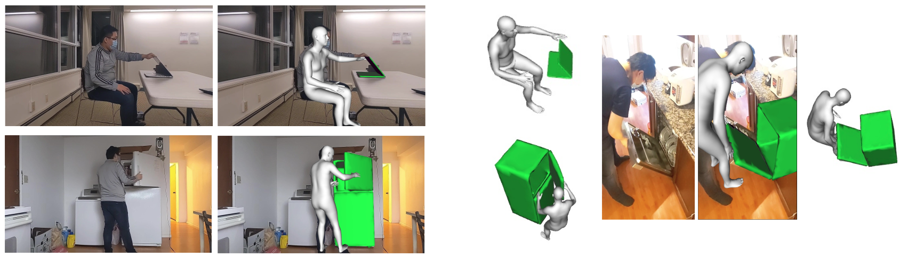
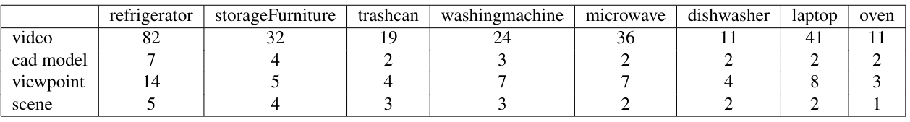

# D3D-HOI: Dynamic 3D Human-Object Interactions from Videos

Xiang Xu, Hanbyul Joo, Greg Mori, Manolis Savva.

[[`arXiv`](https://arxiv.org/abs/2108.08420)]
[[`Bibtex`](#CitingD3DHOI)]

[](https://arxiv.org/abs/2108.08420)


## D3D-HOI Video Dataset 

#### Data Statistics
D3D-HOI video dataset contains a total of 256 videos from 8 categories. Every frame is annotated with the object rotation, translation, size, and part motion in 3D. Below is the per-category breakdown.


Download [D3D-HOI dataset](https://dl.fbaipublicfiles.com/d3d-hoi/d3dhoi_video_data.zip)

Download [original videos](https://dl.fbaipublicfiles.com/d3d-hoi/original_videos.zip)

#### Data Layout
The structure of the D3D-HOI video dataset is as follows:

    <dataset_folder>/
        <class_name>/
            <video_name>/
                3d_info.txt
                jointstate.txt
                <frames>/
                    <image_name>.jpg
                <gt_mask>/
                    <object_mask_name>.npy
                <smplv2d>/
                    <smpl_2d_coord>.npy
                <smplmesh>/
                    <smpl_3d_coord>.obj
                <joints3d>/
                    <joints_3d_coord>.npy

The file `3d_info.txt` contains the object global rotation, global translation and real-world dimensions (in cm) at rest state. It also provide the ground-truth CAD model ID, interacting part ID, and the estimated camera focal lengths. 

The file `jointstate.txt`  stores the ground-truth per-frame part motion. This is either in degree for revolute joint or in cm for primatic joint. 

Original images are in the `frame` folder. Per-frame object masks are in the `gt_mask` folder. Estimated 2D SMPL vertice coordinates are in `smplv2d` folder. Estimated 3D SMPL vertices (after orthographic projection) are in `smplmesh` folder. Estimated 3D SMPL joints are in the `joints3d` folder. We use pretrained model from [EFT](https://github.com/facebookresearch/eft) to estimate the SMPL parameters. 


## SAPIEN PartNet-Mobility Models

#### Pre-processing the Data
Due to legal issue, we can not directly re-distribute the post-processed data. We provide the 24 CAD ID used in our paper [here](https://dl.fbaipublicfiles.com/d3d-hoi/processed_cads_id.zip). Please refer to the `preprocess` folder on how to run the CAD process code for PartNet-Mobility models.


#### Data Layout
After post-process, the structure of the CAD model folder should be as follows:

    <dataset_folder>/
        <class_name>/
            <SAPIEN_id>/
                motion.json
                motion.gif
                <final>/
                    <part_mesh>.obj

The file `motion.json` contains the ground-truth rotation or translation axis origin and direction (at canonical space). It also provides the motion range and motion type (revolute or prismatic). The commonly interacted object vertices are also stored in the `contact` list.   

The file `motion.gif` provides visualization for all possible motions of the model. 

Canonical object part meshes are stored in the `final` folder.


## Requirements
* Python (tested on 3.8)
* PyTorch (tested on 1.7)
* PyTorch3D (tested on 0.3)
* [EFT](https://github.com/facebookresearch/eft)
* [PartNet-Mobility Dataset](https://sapien.ucsd.edu/)
* [Mesh-Fusion](https://github.com/davidstutz/mesh-fusion)


## Installation

We recommend using a conda environment:

```bash
conda create -n d3dhoi python=3.8
conda activate d3dhoi
pip install -r requirements.txt
```

Install the torch version that corresponds to your version of CUDA, eg for CUDA 11.0,
use:
```
conda install -c pytorch pytorch=1.7.0 torchvision cudatoolkit=11.0
```

Install pytorch3d,
use:
```
conda install -c conda-forge -c fvcore fvcore
conda install pytorch3d=0.3.0 -c pytorch3d
```

### Setting up External Dependencies
Compile the [mesh-fusion](https://github.com/davidstutz/mesh-fusion) libraries for running the preprocess code.


## Running the Code 

Refer to the `optimization` folder on how to run the optimization and evaluation code. You can download our [optimized results](https://drive.google.com/file/d/1KSTChTEmu_4w9MqqYds1Fz4yKDY0ylgY/view?usp=sharing). The zip file also provides scripts for reproducing the results for each category.

More optimization results are available [here](https://www.youtube.com/watch?v=LhZ1TkRUznA).

You can also use code the in `visualization` folder to explore the annotated dataset.


## License
Our code is released under [CC-BY-NC 4.0](https://creativecommons.org/licenses/by-nc/4.0/legalcode). 
See the [LICENSE](LICENSE) file. However, our code depends on other libraries,
including SMPL, which each have their own respective licenses that must also be
followed.
 


## References 
We use [mesh-fusion](https://github.com/davidstutz/mesh-fusion) to process [PartNet-Mobility Dataset](https://sapien.ucsd.edu/), and [EFT](https://github.com/facebookresearch/eft) to estimate the SMPL parameters. 

## <a name="CitingD3DHOI"></a>Citing D3D-HOI

If you use find this code helpful, please consider citing:
```BibTeX
@article{xu2021d3dhoi,
  title={D3D-HOI: Dynamic 3D Human-Object Interactions from Videos},
  author={Xiang Xu and Hanbyul Joo and Greg Mori and Manolis Savva},
  journal={arXiv preprint arXiv:2108.08420},
  year={2021}
}
```
