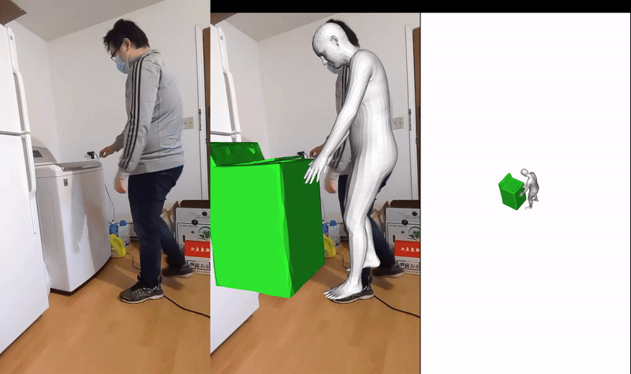
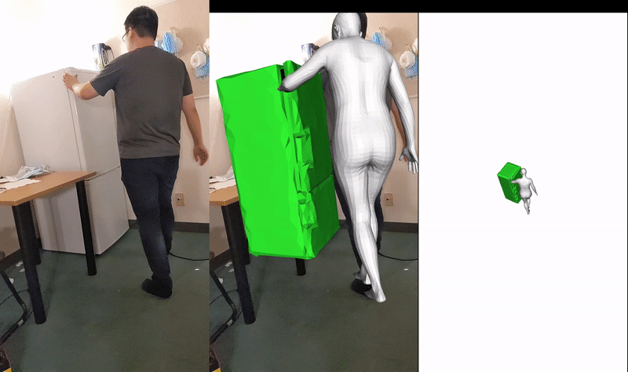

## Optimization

To optimize the object rotation, translation, part motion, and dimension parameters: 
```
python optimize.py  --cadpath /path/to/cad/model
                    --datapath /path/to/video/dataset
                    --category microwave 
                    --hfacing 0.5 --contact 1.0 --objmask 80.0
``` 

You need to specify all the hyperparameter values and the path to video and cad data. Please refer [here](https://drive.google.com/file/d/1KSTChTEmu_4w9MqqYds1Fz4yKDY0ylgY/view?usp=sharing) for the final hyperparameter values used in the paper. 

The file `model.py` defines all the error terms used for optimization. 

The optimized results are stored in `params` folder as per-frame .npy file. For each video, only the best result with the lowest error are kept. 


## Evaluation 

To evaluate the parameter values:
```
python evaluate --cad_path /path/to/cad/model
                --data_path /path/to/video/dataset
                --result_folder /after/optimization/params/folder
                --scale 100.0 
```                        
Scale is a constant value used during optimization to make translation in world-coordinate larger (in cm). For most categories this is set to 100.0. Please use the same value in optimization, otherwise evaluation result will be off.   


## Results 

Some visualizations of the final optimized results. Rendering code is based on `demo_bodymocap.py` in [EFT](https://github.com/facebookresearch/eft/tree/master/demo). 

More results are available [here](https://www.youtube.com/watch?v=LhZ1TkRUznA).
 
 

  
